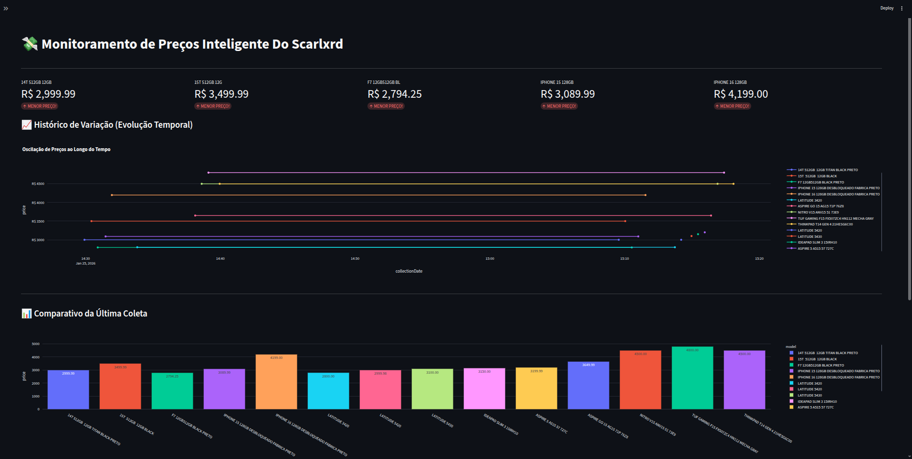

# 💸 Monitor de Preços Inteligente (Scarlxrd Watchlist)


---

## 🎯 O Projeto (Uso Pessoal & Watchlist)

Este é um projeto de **uso estritamente pessoal**, desenvolvido como o meu rastreador customizado de **Watchlist**. Ele foi criado com o objetivo de monitorar automaticamente os produtos que estou "de olho" para compras estratégicas, garantindo que eu saiba exatamente quando o preço cair.

O sistema possui **foco total e suporte ao portal BoaDica**, extraindo com precisão dados de hardware e componentes direto do centro tecnológico do Rio de Janeiro. Para complementar, implementei um suporte leve e funcional para gigantes do varejo como: **Amazon**, **Mercado Livre** e **Casas Bahia**, permitindo uma visão unificada da minha lista de desejos em uma única interface.

---

## 🚀 Diferenciais da Minha Solução

* **Curadoria de Hardware (BoaDica):** Otimizado especificamente para as listagens de lojas físicas e online do Rio de Janeiro, garantindo o melhor preço em componentes.
* **Monitoramento de Watchlist:** Ao contrário de ferramentas genéricas de busca, este sistema trabalha focado na minha lista de URLs pré-definidas, monitorando apenas o que realmente me interessa.
* **Inteligência de Limpeza de Dados:** Implementei uma lógica robusta para tratar problemas crônicos de scrapers, como moedas mal formatadas (centavos grudados) e falta de padronização, garantindo dados 100% confiáveis.
* **Memória Histórica (PostgreSQL):** Utilizo um banco de dados persistente para que o sistema não apenas mostre o preço de agora, mas construa uma linha do tempo real da variação de valor de cada item da minha lista.

---

## 🛠️ Stack Tecnológica

### Backend & Coleta
* **Linguagem:** Java 21 (OpenJDK)
* **Framework:** Spring Boot 3.5.10 (ou 4.x se já atualizou!)
* **Automação:** Selenium WebDriver (Chrome Headless)
* **Build Tool:** Maven 3.9.

### Armazenamento & Infra
* **Banco de Dados:** PostgreSQL 15 (Dockerizado)
* **Orquestração:** Docker Compose

### Análise & Frontend
* **Linguagem:** Python 3.13
* **Dashboard:** Streamlit
* **Visualização:** Plotly Express (Gráficos dinâmicos e históricos)

---

## 📸 Demonstração do Dashboard



> O gráfico de evolução temporal permite identificar quedas de preço instantaneamente através de pontos de coleta históricos.

---

## ⚙️ Como Executar

### 1. Iniciar o Coletor e Banco (Docker)
```bash
docker-compose up --build

# Instalar dependências
pip install -r requirements.txt

# Rodar o dashboard
streamlit run dashboard.py
```

---
