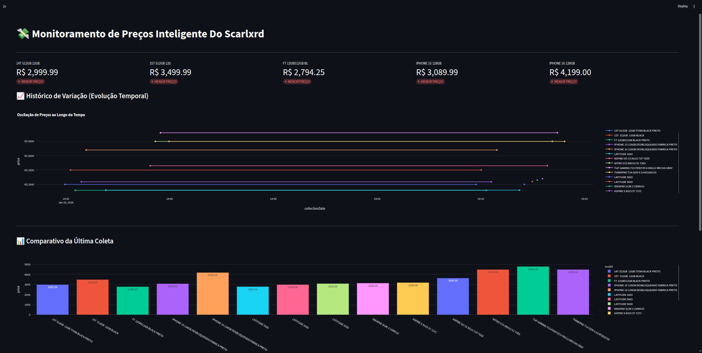

# 💸 Monitor de Preços Inteligente — Scarlxrd Watchlist


Sistema pessoal de monitoramento de preços composto por um coletor em **Java com Spring Boot e Selenium** e um dashboard em **Python com Streamlit, Pandas e Plotly**.

O projeto acompanha uma watchlist definida manualmente, registra o histórico das coletas em um banco **H2 persistido em arquivo** e exporta os dados para um arquivo JSON consumido pelo dashboard.

---

## 🎯 Objetivo

O projeto funciona como uma watchlist pessoal para acompanhar produtos de interesse, comparar ofertas entre lojas e analisar a variação de preços ao longo do tempo.

Em vez de realizar buscas genéricas, o collector processa somente as URLs cadastradas em:

```text
datacollector/urls.txt
```

A cada execução, o sistema:

1. lê a lista de URLs;
2. ignora comentários, linhas em branco e URLs duplicadas;
3. valida e normaliza a URL quando necessário;
4. identifica a loja correspondente;
5. seleciona automaticamente o scraper adequado;
6. abre a página com Chromium em modo headless;
7. captura nome, preço, loja, URL e data da coleta;
8. classifica falhas individualmente sem interromper toda a rodada;
9. persiste os resultados válidos no H2;
10. exporta o histórico completo para `precos.json`;
11. registra um resumo de sucessos e falhas;
12. encerra a aplicação Java.

O dashboard lê somente o JSON gerado pelo collector, sem acessar diretamente o banco H2.

---

## 🏗️ Arquitetura

```text
datacollector/urls.txt
          │
          ▼
┌─────────────────────────────────┐
│ Collector                       │
│                                 │
│ Java 21                         │
│ Spring Boot 4.0.2               │
│ Selenium WebDriver              │
│ Chromium + ChromeDriver         │
│ Strategy por loja               │
└───────────────┬─────────────────┘
                │
                ├──► price-monitor.mv.db
                │        H2 persistente
                │
                └──► precos.json
                          │
                          ▼
              ┌──────────────────────────┐
              │ Dashboard                │
              │                          │
              │ Python 3.13              │
              │ Streamlit                │
              │ Pandas                   │
              │ Plotly                   │
              └──────────────────────────┘
```

O collector é uma aplicação **one-shot**: inicia, realiza a rodada de coleta, persiste os dados, atualiza o JSON e finaliza.

O dashboard pode permanecer ativo continuamente ou ser iniciado somente depois que uma coleta terminar.

---

## ✨ Funcionalidades

### Collector

- leitura das URLs a partir de arquivo externo;
- suporte a comentários e linhas em branco;
- remoção de URLs duplicadas;
- validação de esquema, host, credenciais e portas permitidas;
- detecção automática da loja;
- arquitetura Strategy com um scraper por loja;
- registro automático de novos scrapers como componentes Spring;
- execução com Selenium e Chromium headless;
- normalização de nomes e preços;
- suporte a diferentes formatos monetários;
- persistência histórica no H2;
- exportação do histórico completo para JSON;
- continuação da rodada quando uma URL individual falha;
- resumo final com quantidade de sucessos e falhas;
- classificação estruturada dos erros de coleta;
- caminhos, atrasos e níveis de log configuráveis;
- limite de memória da JVM preparado para ambientes pequenos.

### Classificação de falhas

O collector diferencia os principais tipos de erro encontrados durante a coleta:

```text
NETWORK_ERROR
TIMEOUT
PRODUCT_NOT_FOUND
PRODUCT_UNAVAILABLE
PRICE_NOT_FOUND
SELECTOR_CHANGED
ANTI_BOT_BLOCKED
RATE_LIMITED
INVALID_URL
UNKNOWN
```

Isso permite distinguir problemas de rede, alterações de seletor, produtos indisponíveis e mecanismos anti-bot sem tratar todas as falhas da mesma forma.

Ao final da rodada, o sistema gera um resumo semelhante a:

```text
Coleta concluída parcialmente: 12 sucesso(s) e 3 falha(s)
Resumo das falhas da coleta: {PRICE_NOT_FOUND=1, ANTI_BOT_BLOCKED=2}
```

Se nenhuma URL for coletada com sucesso, o processo termina com erro para sinalizar que a rodada inteira falhou.

### Dashboard

- cadastro de novas URLs compatíveis diretamente pela interface;
- filtros por loja;
- seleção dinâmica de produtos;
- seção **🏆 Melhor Oferta Atual por Produto**;
- seção **🔥 Quedas de Preço**;
- comparação entre o preço atual e a coleta imediatamente anterior;
- exibição da economia em reais e do percentual de queda;
- seção **📈 Histórico de Variação**;
- modo de visualização com todas as coletas ou consolidação diária;
- destaque interativo de um produto no gráfico histórico;
- redução visual de pontos para facilitar a leitura;
- seção **📊 Comparativo da Última Coleta**;
- gráfico horizontal para facilitar a leitura de nomes longos;
- detalhes completos disponíveis por hover;
- tabela com o histórico completo;
- tratamento de dados ausentes;
- formatação monetária em real brasileiro;
- interface responsiva com Streamlit.

> Um produto só aparece em **Quedas de Preço** quando possui pelo menos duas coletas e o preço mais recente é menor que o preço imediatamente anterior. Um produto recém-adicionado não é tratado automaticamente como promoção.

---

## 🏪 Suporte às lojas

| Loja | Situação | Observação |
|---|---|---|
| Amazon | ✅ Funcional | Coleta ativa com Selenium |
| BoaDica | ✅ Funcional | Coleta ativa; produtos indisponíveis podem não fornecer preço |
| KaBuM | ✅ Funcional | Coleta ativa com captura de preço à vista/PIX |
| Mercado Livre | 🧪 Experimental | Integração mantida desativada na watchlist |
| Shopee | 🧪 Experimental | Pode redirecionar o Chromium para verificação de tráfego |
| OLX | 🧪 Experimental | Proteções anti-bot podem responder com HTTP 403 |
| Pichau | 🧪 Experimental | Em testes, o Chromium recebeu a página `Site em Manutenção - Pru Pru` |
| TerabyteShop | 🧪 Experimental | Cloudflare pode manter o Chromium na página `Just a moment...` |

As URLs das integrações experimentais permanecem comentadas em `datacollector/urls.txt`, evitando que sejam executadas nas rodadas normais.

A arquitetura permite adicionar novas lojas criando uma implementação de `ProductScraper` sem concentrar todas as regras em uma única classe.

> Sites de comércio eletrônico podem alterar HTML, seletores, disponibilidade, preços e políticas de automação sem aviso. Por isso, os scrapers podem precisar de manutenção periódica.

---

## 🛠️ Stack tecnológica

### Backend e coleta

- Java 21
- Spring Boot 4.0.2
- Spring Data JPA
- Hibernate
- HikariCP
- Selenium WebDriver
- Chromium
- ChromeDriver
- Maven
- Lombok

### Armazenamento

- H2 embedded
- persistência em arquivo
- exportação em JSON

### Dashboard

- Python 3.13
- Streamlit
- Pandas
- Plotly

### Infraestrutura e automação

- Docker
- Docker Compose
- GitHub Actions
- Docker Buildx
- QEMU
- GitHub Container Registry
- imagens Linux AMD64 e ARM64
- systemd
- Nginx
- Terraform
- Oracle Cloud

---

## 💾 Persistência dos dados

Os dados são armazenados localmente no diretório:

```text
dadosParaDashBoards/
```

Depois da primeira coleta, a estrutura esperada é:

```text
dadosParaDashBoards/
├── price-monitor.mv.db
├── precos.json
└── debug/
```

### `price-monitor.mv.db`

Banco H2 persistente contendo o histórico das coletas.

O banco é aberto dentro da própria JVM do collector e encerrado quando a aplicação termina. Não existe um container ou servidor de banco separado.

### `precos.json`

Arquivo exportado pelo collector e consumido pelo dashboard Streamlit.

O dashboard monta o diretório de dados como somente leitura.

> Os arquivos de banco e histórico não devem ser adicionados ao Git.

---

## 📂 Estrutura do projeto

```text
.
├── .github/
│   └── workflows/
│       ├── ci.yaml
│       └── publish-images.yaml
│
├── components/
│   ├── history_chart.py
│   ├── latest_comparison_chart.py
│   ├── price_drop_cards.py
│   └── url_form.py
│
├── dadosParaDashBoards/
│   ├── .gitkeep
│   ├── price-monitor.mv.db
│   └── precos.json
│
├── datacollector/
│   ├── src/
│   │   ├── main/
│   │   └── test/
│   ├── Dockerfile
│   ├── pom.xml
│   ├── mvnw
│   └── urls.txt
│
├── compose.ghcr-test.yaml
├── docker-compose.yml
├── Dockerfile.dashboard
├── dashboard.py
├── requirements.txt
├── .env.example
├── .dockerignore
├── .gitignore
├── image.png
└── README.md
```

---

## 📸 Dashboard



O dashboard exibe os dados históricos criados pelo collector e permite acompanhar preços atuais, melhores ofertas, quedas recentes e a evolução temporal dos produtos monitorados.

A interface atual organiza as informações na seguinte ordem:

```text
Cadastro de URL
      ↓
Filtros
      ↓
🏆 Melhor Oferta Atual por Produto
      ↓
🔥 Quedas de Preço
      ↓
📈 Histórico de Variação
      ↓
📊 Comparativo da Última Coleta
      ↓
📋 Histórico Completo
```

---

# 🚀 Executando localmente

## Pré-requisitos

É necessário ter instalado:

- Git
- Docker
- Docker Compose

Clone o repositório:

```bash
git clone https://github.com/Sc4rlxrd/Dashboard-Java-e-Python.git

cd Dashboard-Java-e-Python
```

---

## 1. Configurar a watchlist

Edite:

```bash
nano datacollector/urls.txt
```

O arquivo é organizado entre lojas ativas e integrações experimentais.

Exemplo:

```text
# =========================================================
# LOJAS ATIVAS
# =========================================================

# Amazon
https://www.amazon.com.br/...

# BoaDica
https://boadica.com.br/...

# KaBuM
https://www.kabum.com.br/...


# =========================================================
# LOJAS EXPERIMENTAIS / DESATIVADAS
# =========================================================

# OLX
#https://rj.olx.com.br/...

# Pichau
#https://www.pichau.com.br/...

# TerabyteShop
#https://www.terabyteshop.com.br/...
```

Linhas vazias e linhas iniciadas por `#` são ignoradas pelo collector.

---

## 2. Validar o Docker Compose

```bash
docker compose \
  --profile collector \
  config --quiet
```

A ausência de saída indica que o arquivo é válido.

---

## 3. Construir as imagens locais

```bash
docker compose \
  --profile collector \
  build dashboard collector
```

Para forçar um rebuild completo do collector sem utilizar o cache:

```bash
docker compose build --no-cache collector
```

Para realizar o rebuild sem cache e executar imediatamente:

```bash
docker compose build --no-cache collector && \
docker compose --profile collector run --rm collector
```

---

## 4. Executar o collector

Utilizando a imagem já construída:

```bash
docker compose \
  --profile collector \
  run --rm collector
```

Reconstruindo somente as camadas alteradas antes da execução:

```bash
docker compose \
  --profile collector \
  run --rm --build collector
```

O collector deverá:

```text
iniciar o Spring Boot
        ↓
abrir o H2 persistente
        ↓
carregar urls.txt
        ↓
identificar o scraper de cada URL
        ↓
coletar os produtos disponíveis
        ↓
classificar falhas individuais
        ↓
salvar os registros válidos
        ↓
atualizar precos.json
        ↓
exibir o resumo da rodada
        ↓
encerrar
```

Verifique os arquivos:

```bash
ls -lh dadosParaDashBoards/
```

---

## 5. Subir o dashboard

```bash
docker compose up -d dashboard
```

Verifique o container:

```bash
docker compose ps
```

Acompanhe os logs:

```bash
docker compose logs -f dashboard
```

Abra no navegador:

```text
http://127.0.0.1:8501
```

Teste o endpoint de saúde:

```bash
curl --fail --silent --show-error \
  http://127.0.0.1:8501/_stcore/health
```

Resposta esperada:

```text
ok
```

---

## 6. Encerrar o ambiente

```bash
docker compose down
```

Os arquivos dentro de `dadosParaDashBoards` permanecem no host.

---

# 📦 Testando as imagens publicadas no GHCR

O arquivo:

```text
compose.ghcr-test.yaml
```

executa as imagens publicadas no GitHub Container Registry.

Nesse fluxo:

```text
collector inicia
        ↓
coleta e atualiza os dados
        ↓
collector termina com código 0
        ↓
dashboard inicia
```

## Imagens publicadas

```text
ghcr.io/sc4rlxrd/price-monitor-collector
ghcr.io/sc4rlxrd/price-monitor-dashboard
```

Cada publicação possui:

```text
latest
sha-<commit>
```

Exemplo:

```text
ghcr.io/sc4rlxrd/price-monitor-collector:sha-3ecebf8
ghcr.io/sc4rlxrd/price-monitor-dashboard:sha-3ecebf8
```

---

## Executar a versão AMD64

AMD64 é utilizada por computadores e VMs baseados em processadores Intel ou AMD.

```bash
TARGET_PLATFORM=linux/amd64 \
IMAGE_TAG=sha-3ecebf8 \
docker compose \
  -f compose.ghcr-test.yaml \
  up -d
```

Acompanhe:

```bash
docker compose \
  -f compose.ghcr-test.yaml \
  logs -f collector dashboard
```

Verifique:

```bash
docker compose \
  -f compose.ghcr-test.yaml \
  ps -a
```

Estado esperado:

```text
collector   Exited (0)
dashboard   Up
```

---

## Executar a versão ARM64

ARM64 é utilizada, por exemplo, em instâncias Oracle Ampere.

Em uma máquina AMD64, é necessário registrar a emulação:

```bash
docker run \
  --privileged \
  --rm \
  tonistiigi/binfmt \
  --install arm64
```

Crie um diretório separado:

```bash
mkdir -p dadosParaDashBoards-arm64
```

Execute:

```bash
TARGET_PLATFORM=linux/arm64 \
IMAGE_TAG=sha-3ecebf8 \
DATA_DIR=./dadosParaDashBoards-arm64 \
DASHBOARD_PORT=8502 \
docker compose \
  -p price-monitor-arm64 \
  -f compose.ghcr-test.yaml \
  up -d
```

Acesse:

```text
http://127.0.0.1:8502
```

A execução ARM64 por emulação pode ser mais lenta, principalmente no collector com Java, Chromium e Selenium.

---

## Variáveis do Compose de teste

| Variável | Valor padrão | Descrição |
|---|---:|---|
| `IMAGE_TAG` | `sha-3ecebf8` | Tag das imagens no GHCR |
| `TARGET_PLATFORM` | `linux/amd64` | Arquitetura utilizada |
| `DATA_DIR` | `./dadosParaDashBoards` | Diretório persistente |
| `DASHBOARD_PORT` | `8501` | Porta publicada no host |
| `COLLECTOR_DELAY_MS` | `8000` | Intervalo entre as URLs |
| `COLLECTOR_LOG_LEVEL` | `INFO` | Nível de log do collector |

---

# ⚙️ Configurações do collector

| Variável | Valor padrão | Descrição |
|---|---|---|
| `H2_DATABASE_PATH` | `/app/data/price-monitor` | Caminho do banco H2 |
| `SPRING_DATASOURCE_USERNAME` | `sa` | Usuário local do H2 |
| `JPA_DDL_AUTO` | `update` | Mantém o schema entre execuções |
| `COLLECTOR_ENABLED` | `true` | Ativa o runner de coleta |
| `COLLECTOR_URLS_FILE` | `/app/urls.txt` | Arquivo da watchlist |
| `COLLECTOR_OUTPUT_FILE` | `/app/data/precos.json` | Arquivo exportado |
| `COLLECTOR_DELAY_MS` | `8000` | Espera entre URLs |
| `COLLECTOR_LOG_LEVEL` | `INFO` | Nível de log da aplicação |
| `CHROME_BIN` | `/usr/bin/chromium-browser` | Binário do Chromium |
| `CHROMEDRIVER_PATH` | `/usr/bin/chromedriver` | Binário do ChromeDriver |

A imagem do collector utiliza:

```text
-Xms64m
-Xmx192m
-XX:+ExitOnOutOfMemoryError
```

Esses valores foram escolhidos para reduzir o consumo da JVM em ambientes com pouca memória.

---

# 🧪 Testes

Os testes Java utilizam H2 em memória:

```text
jdbc:h2:mem:
```

Durante os testes, o runner de coleta é desativado para impedir:

- abertura do Chromium;
- chamadas externas;
- scraping durante a CI;
- alterações nos arquivos persistentes.

A suíte possui cobertura unitária para partes centrais do collector, incluindo:

- `CollectionException`;
- classificação de falhas;
- `PriceParser`;
- `ScraperService`;
- carregamento do contexto Spring.

Execute localmente:

```bash
cd datacollector

./mvnw \
  --batch-mode \
  --no-transfer-progress \
  clean verify
```

Ou com Maven instalado no sistema:

```bash
mvn clean test
```

Resultado esperado:

```text
BUILD SUCCESS
```

---

# 🔄 CI/CD

O projeto possui dois workflows:

```text
.github/workflows/
├── ci.yaml
└── publish-images.yaml
```

## Continuous Integration

O workflow `ci.yaml` valida:

- build e testes do collector com Java 21;
- configuração do Spring;
- H2 em memória nos testes;
- instalação das dependências Python;
- conflitos entre dependências com `pip check`;
- sintaxe do dashboard;
- imports do Pandas, Plotly e Streamlit;
- configuração do Docker Compose;
- build das imagens Docker;
- compatibilidade com Linux AMD64 e ARM64.

As imagens multi-arquitetura são validadas com:

- Docker Buildx;
- QEMU;
- `linux/amd64`;
- `linux/arm64`.

---

## Publicação das imagens

Depois que a CI da branch `master` termina com sucesso, o workflow `publish-images.yaml` publica:

```text
ghcr.io/sc4rlxrd/price-monitor-dashboard:latest
ghcr.io/sc4rlxrd/price-monitor-dashboard:sha-<commit>

ghcr.io/sc4rlxrd/price-monitor-collector:latest
ghcr.io/sc4rlxrd/price-monitor-collector:sha-<commit>
```

Cada tag contém um manifesto multi-plataforma:

```text
tag
├── linux/amd64
└── linux/arm64
```

Assim, o mesmo nome de imagem pode ser usado em:

- computadores Intel;
- computadores AMD;
- VMs Oracle AMD;
- servidores Linux x86-64;
- instâncias Oracle Ampere ARM64.

O Docker seleciona automaticamente a variante compatível com a máquina.

---

# 🐳 Dockerfiles

## Collector

O collector utiliza um build multi-stage:

```text
maven:3.9.6-eclipse-temurin-21-alpine
                    ↓
eclipse-temurin:21-jre-alpine
```

Durante o build:

1. as dependências Maven são baixadas;
2. o projeto é compilado;
3. somente o JAR final é copiado para a imagem de runtime;
4. Chromium, ChromeDriver e fontes são instalados.

O Dockerfile utiliza cache do Maven durante o build para acelerar recompilações. Quando necessário, o cache pode ser ignorado com `docker compose build --no-cache collector`.

## Dashboard

O dashboard utiliza:

```text
python:3.13-slim
```

A imagem:

- instala as dependências do `requirements.txt`;
- executa com usuário sem privilégios;
- expõe a porta `8501`;
- possui healthcheck;
- desativa telemetria do Streamlit;
- monta os dados como somente leitura.

---

# 🔐 Segurança e isolamento

O projeto aplica algumas medidas básicas:

- dashboard publicado somente em `127.0.0.1:8501` no ambiente local;
- dados montados como somente leitura no dashboard;
- collector sem porta publicada;
- watchlist externa à imagem;
- banco H2 sem acesso de rede;
- collector executado como processo one-shot;
- `.env` e arquivos persistentes ignorados pelo Git;
- imagens versionadas por SHA;
- publicação no GHCR por `GITHUB_TOKEN`;
- redes Docker separadas para frontend e saída do collector.

---

# ⚠️ Limitações

- alterações no HTML das lojas podem quebrar seletores;
- preços podem variar conforme usuário, região, estoque, sessão ou forma de pagamento;
- páginas podem exigir cookies, CAPTCHA ou verificação de tráfego;
- Amazon pode apresentar comportamento diferente dependendo do ambiente ou IP de origem;
- Mercado Livre permanece experimental;
- Shopee pode redirecionar sessões headless para verificação;
- OLX pode responder com HTTP 403 devido à proteção anti-bot;
- Pichau permanece experimental enquanto as sessões automatizadas recebem a página de manutenção;
- TerabyteShop permanece experimental devido à proteção do Cloudflare;
- produtos removidos ou indisponíveis podem não retornar preço;
- integrações experimentais não fazem parte da rodada padrão da watchlist;
- a execução ARM64 em máquina AMD64 depende de emulação e será mais lenta;
- o sistema foi desenvolvido para uso pessoal e não representa uma plataforma comercial.

---

# ☁️ Implantação na Oracle Cloud

A implantação em Oracle Cloud utiliza uma VM separada do repositório da aplicação.

O fluxo de produção utiliza as imagens previamente publicadas no GHCR, evitando builds pesados diretamente na VM.

Estrutura geral:

```text
Oracle VM
│
├── Nginx
│
├── Dashboard Streamlit
│
├── dados persistentes
│   ├── price-monitor.mv.db
│   └── precos.json
│
└── Collector one-shot
        │
        ├── Java
        ├── Selenium
        └── Chromium
```

O collector é acionado periodicamente por `systemd timer`.

Durante uma rodada:

```text
timer dispara
      ↓
collector inicia
      ↓
H2 é aberto
      ↓
Chromium realiza as coletas
      ↓
histórico e JSON são atualizados
      ↓
collector finaliza
      ↓
dashboard continua utilizando o JSON persistido
```

A infraestrutura da VM é mantida separadamente e utiliza Terraform, scripts de bootstrap e automações próprias de deploy.

---

# 📌 Propósito do projeto

Além de atender uma necessidade pessoal, este repositório é utilizado como laboratório prático para estudo de:

- Java;
- Spring Boot;
- Selenium;
- Python;
- Streamlit;
- persistência de dados;
- tratamento e classificação de erros;
- arquitetura Strategy;
- testes automatizados;
- Docker;
- Docker Compose;
- imagens multi-arquitetura;
- GitHub Actions;
- CI/CD;
- GHCR;
- Linux;
- systemd;
- Nginx;
- Terraform;
- Oracle Cloud;
- monitoramento e automação.

---

## 👤 Autor

Desenvolvido por **Guilherme D. Santos — Scarlxrd**.

GitHub:

```text
https://github.com/Sc4rlxrd
```

---

## 📄 Observação

Projeto de uso pessoal e educacional.

Os preços apresentados dependem das informações disponíveis nas páginas monitoradas e podem não refletir promoções condicionais, frete, cupons, variações regionais, formas de pagamento específicas ou alterações realizadas pelas lojas.